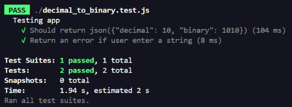

# Software Engineering 4th Semester | Versioning | Testing | Containerization | Documentation

## Project Overview

This project was developed as part of my **4th semester of Software Engineering**.

The project consists of a simple API that receives a decimal number and converts it into its binary representation.

The project will be developed in multiple stages:

- [x] Initial API implementation
- [ ] Versioning with Git
- [ ] Automated testing
- [ ] Containerization with Docker
- [ ] Final documentation 

---

## Presenting the Code

The first part of the project consists of creating a basic API using **Node.js** and **Express.js**.

```javascript
const express = require("express");
const app = express();
const port = 3000;

app.get("/decimal_to_binary/:decimal", (req, res) => {
    const decimal = parseInt(req.params.decimal);

    // check if decimal is a number

    if (isNaN(decimal)) {
        return res.send("Enter a number value");
    }

    const binary = decimal.toString(2);

    return res.json({
        "decimal": decimal,
        "binary": binary
    });
});

app.listen(port, () => {
    console.log("App listening on port", port);
});
```

## Versioning 

### 1st Commit

To version the code and create the first commit on branch main, I used the following simple git commands:

1. git init 
2. git add . 
3. git status
4. git commit -m'initial commit'
5. git log
6. git branch -M main
7. git remote add origin https://github.com/dani-ayumi-dev/Software-Engineering-4th-Semester-Versioning-Testing-Containerization-Documentation
8. git push -u origin main

### 2nd Commit with Branch

The new code has a new feature: now the user can also convert decimal to hexadecimal with a new endpoint
```javascript
        const express = require("express");
    const app = express();
    const port = 3000

    app.get("/decimal_to_binary/:decimal", (req, res)=>{
        const decimal = parseInt(req.params.decimal);

        // check if decimal is a number

        if(isNaN(decimal)){
            return res.send("Enter a number value");
        }

        const binary = decimal.toString(2);

        return res.json({"decimal":decimal,
            "binary": binary
        })

    });

    app.get("/to-hex/:decimal", (req, res)=>{
        const decimal = parseInt(req.params.decimal);

        if(isNaN(decimal)){
            return res.send("Enter a number value")
        }

        const hexadecimal = decimal.toString(16);

        return res.json({
            "decimal": decimal,
            "hexadecimal": hexadecimal
        })
    })

    app.listen(port, ()=>{
        console.log("App listening on port", port)
    })
```
To version the changes in the code, I created an branch called feature-hexadecimal

Git commands used:

1. git branch checkout -b feature-hexadecimal
2. git commit -m'hexadecimal get route is added'
3. git push origin feature-hexadecimal
3. git checkout main
4. git merge feature-hexadecimal

## Testing with Jest using TDD (Test-Driven Development)

I wrote a test using Jest in the file decimal_to_binary.test.js

The code:

```` javascript 
    const app = require("./decimal_to_binary.js");
const request = require("supertest")

describe("Testing app", ()=>{

    it('Should return json({"decimal": 10, "binary": 1010})', async ()=>{

        const response = await request(app).get("/decimal_to_binary/10");

        expect(response.status).toBe(200);
        expect(response.body).toEqual({"decimal": 10,
        "binary": "1010"
    });

    });

    it("Return an error if user enter a string", async ()=>{
        const response = await request(app).get("/decimal_to_binary/a");

        expect(response.status).toBe(400);
        expect(response.body).toEqual({error: "Enter a number value"})
    })
    
})
````
The output:




