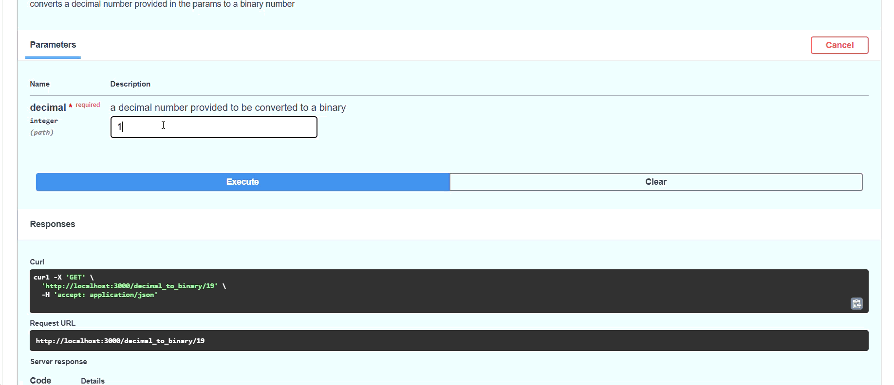
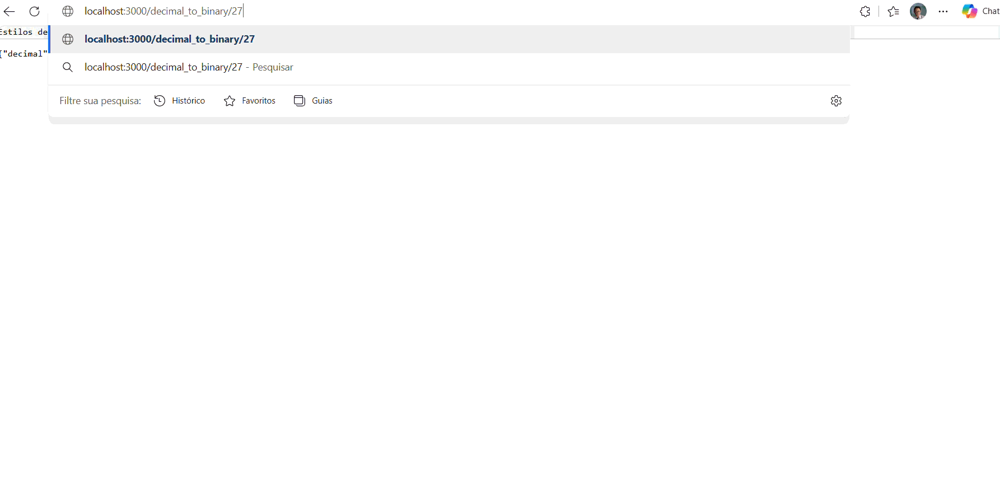

# Software Engineering 4th Semester | Versioning | Testing | Containerization | Documentation

## Project Overview

This project was developed as part of my **4th semester of Software Engineering**.

The project consists of a simple API that receives a decimal number and converts it into its binary representation.

The project will be developed in multiple stages:

- [x] Initial API implementation
- [x] Versioning with Git
- [x] Automated testing with Jest
- [x] Automating documentations
- [x] Containerization with Docker

---

## Presenting the Code

The first part of the project consists of creating a basic API using **Node.js** and **Express.js**.

```javascript
const express = require("express");
const app = express();
const port = 3000;

app.get("/decimal_to_binary/:decimal", (req, res) => {
    const decimal = parseInt(req.params.decimal);

    // check if decimal is a number

    if (isNaN(decimal)) {
        return res.send("Enter a number value");
    }

    const binary = decimal.toString(2);

    return res.json({
        "decimal": decimal,
        "binary": binary
    });
});

app.listen(port, () => {
    console.log("App listening on port", port);
});
```

## Versioning 

### 1st Commit

To version the code and create the first commit on branch main, I used the following simple git commands:

1. git init 
2. git add . 
3. git status
4. git commit -m'initial commit'
5. git log
6. git branch -M main
7. git remote add origin https://github.com/dani-ayumi-dev/Software-Engineering-4th-Semester-Versioning-Testing-Containerization-Documentation
8. git push -u origin main

### 2nd Commit with Branch

The new code has a new feature: now the user can also convert decimal to hexadecimal with a new endpoint
```javascript
        const express = require("express");
    const app = express();
    const port = 3000

    app.get("/decimal_to_binary/:decimal", (req, res)=>{
        const decimal = parseInt(req.params.decimal);

        // check if decimal is a number

        if(isNaN(decimal)){
            return res.send("Enter a number value");
        }

        const binary = decimal.toString(2);

        return res.json({"decimal":decimal,
            "binary": binary
        })

    });

    app.get("/to-hex/:decimal", (req, res)=>{
        const decimal = parseInt(req.params.decimal);

        if(isNaN(decimal)){
            return res.send("Enter a number value")
        }

        const hexadecimal = decimal.toString(16);

        return res.json({
            "decimal": decimal,
            "hexadecimal": hexadecimal
        })
    })

    app.listen(port, ()=>{
        console.log("App listening on port", port)
    })
```
To version the changes in the code, I created an branch called feature-hexadecimal

Git commands used:

1. git branch checkout -b feature-hexadecimal
2. git commit -m'hexadecimal get route is added'
3. git push origin feature-hexadecimal
3. git checkout main
4. git merge feature-hexadecimal

## Testing with Jest using TDD (Test-Driven Development)

I wrote a test using Jest in the file decimal_to_binary.test.js

The code:

```` javascript 
    const app = require("./decimal_to_binary.js");
    const request = require("supertest")

describe("Testing app", ()=>{

    it('Should return json({"decimal": 10, "binary": 1010})', async ()=>{

        const response = await request(app).get("/decimal_to_binary/10");

        expect(response.status).toBe(200);
        expect(response.body).toEqual({"decimal": 10,
        "binary": "1010"
    });

    });

    it("Return an error if user enter a string", async ()=>{
        const response = await request(app).get("/decimal_to_binary/a");

        expect(response.status).toBe(400);
        expect(response.body).toEqual({error: "Enter a number value"})
    })
    
})
````
The output:


### Refactoring

The next step is to add a middleware to the code by creating another file called validateDecimal.js. which checks if the variable decimal is a decimal

````javascript
const validateDecimal = (req, res, next) => {
    const decimal = parseInt(req.params.decimal, 10)

    if(isNaN(decimal)){
        return res.status(400).json({error: "Please, enter a number"})
    }
    req.decimal = decimal;

    next()
};

module.exports = validateDecimal
````

And then add this middleware (validateDecimal) to the original code.

````javascript
app.get("/decimal_to_binary/:decimal", validateDecimal ,(req, res)=>{
    
    
    const binary = decimal.toString(2);

    res.json({"decimal":decimal,
        "binary": binary
    })

});

````

## Automating Documentations with Swagger

### 1st Step: Create a OPENAPI yml file

````yml
# Project
openapi: 3.0.0
info:  
  title: Decimal to Binary
  version: 1.0.0  
  description: An API that converts decimal to Binary

# Endpoints
#  - `/decimal-to-binary/:decimal`: Converts decimal number to binary number

# Servers

servers:
  - url: http://localhost:3000
    description: Local development server
paths:
  /decimal-to-binary/{decimal}:
    get:
      summary: Convert to Binary
      description: converts a decimal number provided in the params to a binary number
# parameters
      parameters:
        - name: decimal
          in: path
          required: true
          description: a decimal number provided to be converted to a binary
          schema: 
            type: integer
            example: 10

        #Responses
      responses:
        '200':
          description: if the code succeeds
          content: 
            application/json:
              schema:
                type: object
                properties:
                  decimal:
                    type: integer
                    example: 10
                  binary:
                    type: string
                    example: "1010"
        '400':
          description: if code fails
          content:
            application/json:
              schema:
                type: object
                properties:
                  error:
                    type: string
                    example: "Please, enter a number"
````
2nd step: Access https://editor.swagger.io/ to generate the documentation

To allows cross-origin request, I installed cors

    npm install cors

And imported it inside the code:

````javascript
const express = require("express");
const validateDecimal = require("./validateDecimal")
const validateDecimalifOdd = require("./validateIfOdd")
const cors = require("cors")
const app = express();
const port = 3000

app.use(cors())
````

3rd step: execute the request in the Swagger documentation:



## Containerization with Docker

### decimal_to_binary endpoint

I added a mySQL database to the API using Docker using phpAdmin.

#### 1st Step: build the docker-compose file

````yml
services:
  mysql:
    image: mysql:8.0
    container_name: daylors_container
    restart: always
    environment:
      MYSQL_ROOT_PASSWORD: password 
      MYSQL_DATABASE: conversions_db
      MYSQL_USER: user
      MYSQL_PASSWORD: userpassword
    ports:
      - "3306:3306"
    volumes:
      - mysql_data:/var/lib/mysql
  phpmyadmin:
    image: phpmyadmin:latest
    container_name: phpmyadmin-container
    restart: always
    environment:
      PMA_HOST: mysql
      PMA_USER: root
      PMA_PASSWORD: password
    ports:
      - "8080:80"

volumes:
  mysql_data:
````

#### 2nd Step: build the endpoint and connect it to the database

````javascript
// Import express, and mysql2
const express = require("express");
const mysql = require("mysql2");
const validateDecimal = require("../validateDecimal");
const app = express();
const port = 3000


// DEFINING DB INFORMATION
// Create a variable that stores the connection to the database

// host means: "in which engine or server mySQL db is running?"

// Windows:3306 ──────> mysql-container:3306

const db = mysql.createConnection({
    host: "localhost",
    user: "user", // defined in the docker-compose.yml. This will be the user that will access the db
    password: "userpassword",
    database: "conversions_db",

});

// CONNECT TO THE DATABASE using db as the connection

db.connect((err)=>{
    if(err){
        console.error("Failed trying to connect to the database", err);
        return
    }

    console.log("Connected to mySQL database (Docker)")
})

// Define the endpoint

app.get("/decimal_to_binary/:decimal", validateDecimal,(req, res)=>{
    const binary = (req.decimal).toString(2)

    //  save in the database

// Define the query

    const query = "INSERT INTO conversions (decimal_number, binary_number) VALUES (?,?)"
// db.query() will save the results into the database 
    db.query(query,[req.decimal, binary], (err, result)=>{
        if(err){
            console.error("Failed to save to the database", err);
            return res.status(500).json({error: "Failed to save to the database"})
        }

        res.json({"decimal": req.decimal, "binary": binary})
    })
})

app.listen(port, ()=>{
    console.log("Endpoint running on port", port)
})


````

#### Output on phpAdmin (localhost:8080)




### Creating Dockers for other endpoints


|Path | Description| link|
|-----|--------------|----|
|/to-hex/:decimal|endpoint that converts a decimal number to an hexadecimal number||


